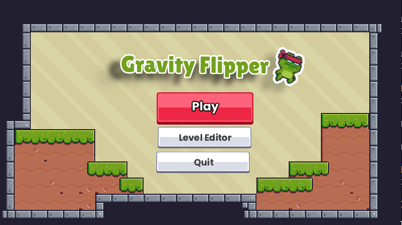
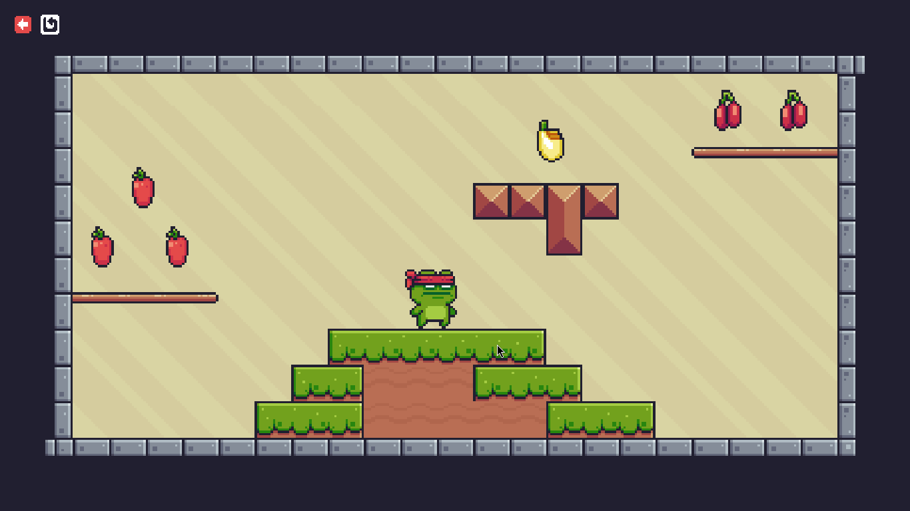
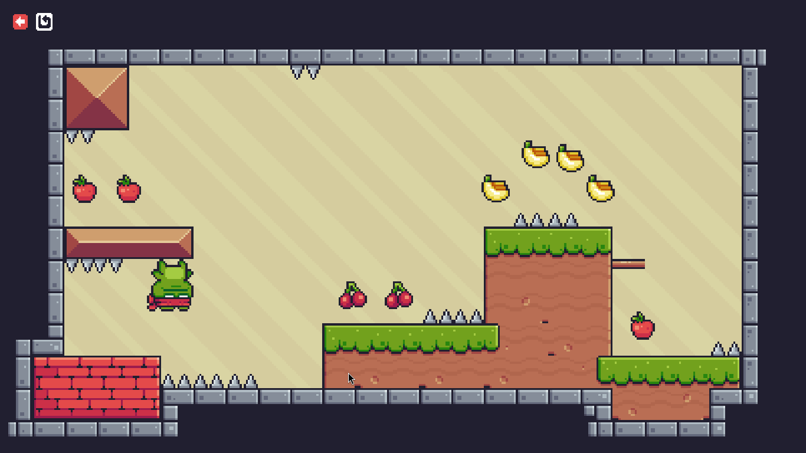
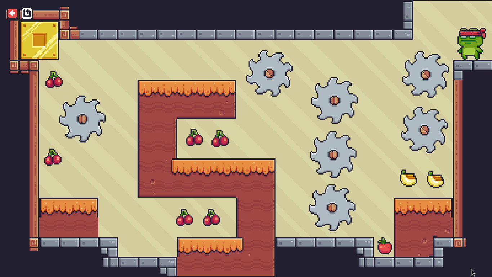
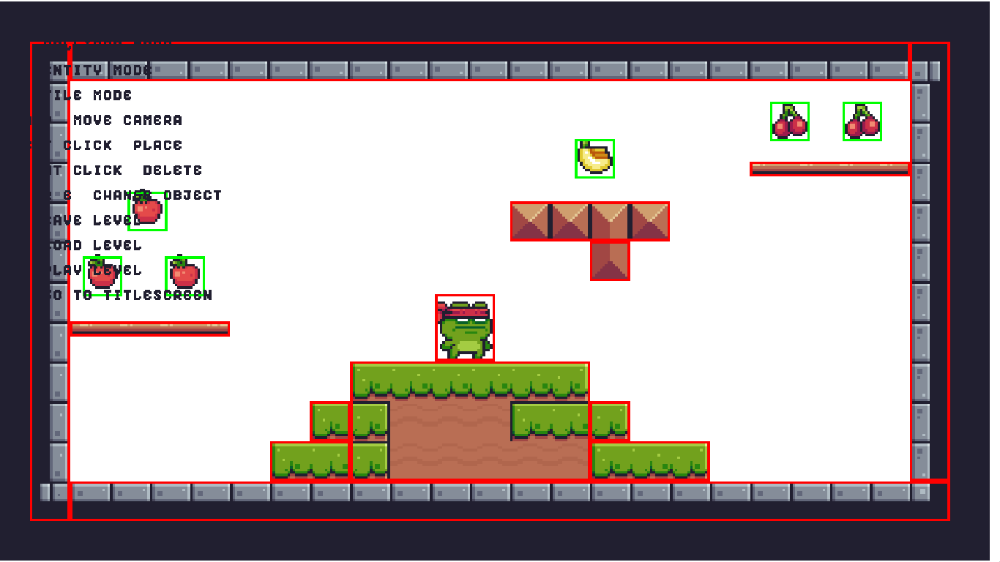
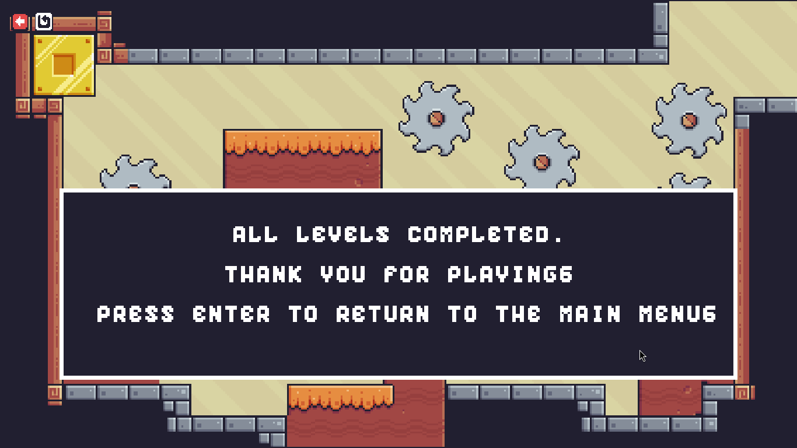

# Gravity Flipper

Gravity Flipper is a 2D puzzle-platformer game developed in C# using .NET 10 and SDL.

The player controls a character that cannot jump. Instead, gravity can be flipped to move between the floor and the ceiling. The objective is to collect all fruits in each level while avoiding hazards such as saws and traps. Once all fruits are collected, the next level is loaded automatically.

## Features

* Gravity flipping mechanic
* Multiple levels
* Fruit collection system
* Automatic level progression
* Win condition
* Save and load support
* Collision detection
* Camera system
* Custom level editor

## Controls

| Key             | Action       |
| --------------- | ------------ |
| A / Left Arrow  | Move Left    |
| D / Right Arrow | Move Right   |
| Space           | Flip Gravity |


## Level Editor Controls

| Key            | Action                         |
|----------------|--------------------------------|
| Q | Previous object                             |
| E | Next object                                 |
| Left Click | Place entity/tile or start collider|
| Right Click | Delete entity/tile                |
| J | Save level manually                         |
| K | Load level                                  |
| M | Go to title screen                          |
| C | Collider mode                               |
| O | Entity mode                                 |
| T | Tile mode                                   |
| W | Move camera up                              |
| A | Move camera left                            |
| S | Move camera down                            |
| D | Move camera right                           |
| Drag Mouse | Create collider (in collider mode) |
| P | Play level (enter play mode)                |
| ESC | Return to editor (while in play mode)     |


## Gameplay

The goal of the game is to collect every fruit in the level.

The player cannot jump. Instead, gravity can be inverted at any time, allowing movement on both the floor and the ceiling.

After collecting all fruits, the next level is loaded automatically. Completing the final level wins the game.

## Build and Run

Requirements:

* .NET 10 SDK

Run the game:

```bash
dotnet run
```

## Project Structure

```text
src/
├── Core/       # Game loop, camera, GUI, SDL initialization
├── Entities/   # Player, collectibles, traps and entity management
├── Input/      # Keyboard and mouse input handling
├── Physics/    # Collision system
├── Rendering/  # Textures and animations
├── Screens/    # Title screen, gameplay and level editor
└── World/      # Tiles, backgrounds and world management
```

## Main Components

### Core

Contains the main game framework, including the game loop, screen manager, camera, GUI utilities, and SDL initialization.

### Entities

Contains all gameplay entities such as the player, collectibles, traps, saws, invisible colliders, and the entity manager.

### Input

Handles keyboard and mouse input.

### Physics

Provides collision detection through the collider system.

### Rendering

Manages textures, sprites, and animations.

### Screens

Implements the different game states, including the title screen, gameplay screen, and level editor.

### World

Manages tiles, backgrounds, and world boundaries.

## Technical Requirements Implemented

* Game loop (Input → Update → Render)
* User input handling
* Win condition
* Persistent save/load system
* Multiple game states
* Object-oriented design
* Interfaces (`IScreen`)
* Inheritance (`Entity` base class)
* Generics (`EntityManager`)
* LINQ usage

## Screenshots

### Title Screen



### Level 1



### Level 2



### Level 3



### Level Editor



### Victory Screen




## AI Usage

See `AI_USAGE.md` for details about AI-assisted development.
